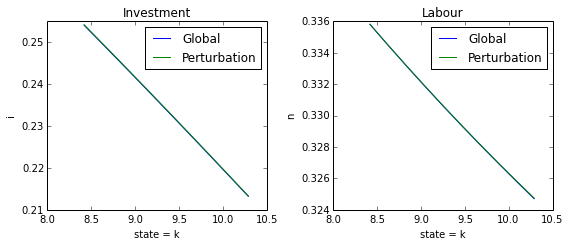

RBC Tutorial
==============

Solving the rbc model
---------------------

This worksheet demonstrates how to solve the RBC model with the
`dolo <http://econforge.github.io/dolo/>`__ library and how to generates
impulse responses and stochastic simulations from the solution.

-  This notebook is distributed with dolo in : ``examples\notebooks\``.
   The notebook was opened and run from that directory.
-  The model file is in : ``examples\global_models\``

First we import the dolo library.

.. code:: python

    %pylab inline

.. parsed-literal::

    Populating the interactive namespace from numpy and matplotlib

.. code:: python

    from dolo import *
The RBC model is defined in a
`YAML <http://www.yaml.org/spec/1.2/spec.html#Introduction>`__ file
which we can read locally or pull off the web.

.. code:: python

    filename = ('https://raw.githubusercontent.com/EconForge/dolo'
                '/master/examples/models/compat/rbc.yaml')

    #filename='../models/rbc.yaml'

    pcat(filename)

.. raw:: html

    
        <table class="sourcetable"><tr><td class="linenos">
<pre> 1
     2
     3
     4
     5
     6
     7
     8
     9
    10
    11
    12
    13
    14
    15
    16
    17
    18
    19
    20
    21
    22
    23
    24
    25
    26
    27
    28
    29
    30
    31
    32
    33
    34
    35
    36
    37
    38
    39
    40
    41
    42
    43
    44
    45
    46
    47
    48
    49
    50
    51
    52
    53
    54
    55
    56
    57
    58
    59
    60
    61
    62
    63
    64
    65
    66
    67
    68
    69
    70
    71
    72</pre>
</td><td class="code">
<pre>name: RBC

    model_spec: fga

    symbols:

       states:  [z, k]
       controls: [i, n]
       auxiliaries: [c, rk, w]
       values: [V]
       shocks: [e_z]

       parameters: [beta, sigma, eta, chi, delta, alpha, rho, zbar, sig_z ]

    equations:

       arbitrage:
          - 1 = beta*(c/c(1))^(sigma)*(1-delta+rk(1))   | 0 &lt;= i &lt;= inf
          - w - chi*n^eta*c^sigma                  | 0 &lt;= n &lt;= inf

       transition:
          - z = (1-rho)*zbar + rho*z(-1) + e_z
          - k = (1-delta)*k(-1) + i(-1)

       auxiliary:
          - c = z*k^alpha*n^(1-alpha) - i
          - rk = alpha*z*(n/k)^(1-alpha)
          - w = (1-alpha)*z*(k/n)^(alpha)

       value:
          - V = log(c) + beta*V(1)

    calibration:

          beta : 0.99
          phi: 1
          chi : w/c^sigma/n^eta
          delta : 0.025
          alpha : 0.33
          rho : 0.8
          sigma: 1
          eta: 1
          zbar: 1
          sig_z: 0.016

          z: zbar
          rk: 1/beta-1+delta
          w: (1-alpha)*z*(k/n)^(alpha)
          n: 0.33
          k: n/(rk/alpha)^(1/(1-alpha))
          i: delta*k
          c: z*k^alpha*n^(1-alpha) - i

          V: log(c)/(1-beta)

    covariances:

          [ [ sig_z**2] ]

    options:

        approximation_space:
            a: [ 1-2*sig_z, k*0.9 ]
            b: [ 1+2*sig_z, k*1.1 ]
            orders: [10, 50]
    </pre>

    </td></tr></table>

``yaml_import(filename)`` reads the YAML file and generates a model
object.

.. code:: python

    model = yaml_import(filename)
The model file already has values for steady-state variables stated in
the calibration section so we can go ahead and check that they are
correct by computing the model equations at the steady state.

.. code:: python

    model.residuals()

.. parsed-literal::

    OrderedDict([('transition', array([  0.00000000e+00,   2.50466314e-13])), ('arbitrage', array([ -1.01030295e-14,  -3.78141962e-12])), ('auxiliary', array([ -3.28626015e-13,   7.63278329e-17,   4.48352466e-12])), ('value', array([  7.81597009e-14]))])

Printing the model also lets us have a look at all the model equations
and check that all residual errors are 0 at the steady-state, but with
less display prescision.

.. code:: python

    print( model )

.. parsed-literal::

    Model object:
    ------------

    - name: "RBC"
    - type: "fga"
    - file: "https://raw.githubusercontent.com/EconForge/dolo/master/examples/models/compat/rbc.yaml

    - residuals:

        transition
            1   : 0.0000 : z = (1-rho)*zbar + rho*z(-1) + e_z
            2   : 0.0000 : k = (1-delta)*k(-1) + i(-1)

        arbitrage
            1   : 0.0000 : 1 = beta*(c/c(1))**(sigma)*(1-delta+rk(1))   | 0 <= i <= inf
            2   : 0.0000 : w - chi*n**eta*c**sigma                  | 0 <= n <= inf

        auxiliary
            1   : 0.0000 : c = z*k**alpha*n**(1-alpha) - i
            2   : 0.0000 : rk = alpha*z*(n/k)**(1-alpha)
            3   : 0.0000 : w = (1-alpha)*z*(k/n)**(alpha)

        value
            1   : 0.0000 : V = log(c) + beta*V(1)

Next we compute a solution to the model using a second order
perturbation method (see the source for the
`approximate\_controls <https://github.com/EconForge/dolo/blob/master/dolo/algos/fg/perturbations.py>`__
function). The result is a decsion rule object. By decision rule we
refer to any object is callable and maps states to decisions. This
particular decision rule object is a TaylorExpansion (see the source for
the
`TaylorExpansion <https://github.com/EconForge/dolo/blob/master/dolo/numeric/taylor_expansion.py>`__
class).

.. code:: python

    dr_pert = approximate_controls(model, order=2)

.. parsed-literal::

    There are 2 eigenvalues greater than 1. Expected: 2.

We now compute the global solution (see the source for the
`time\_iteration <https://github.com/EconForge/dolo/blob/master/dolo/algos/fg/time_iteration.py>`__
function). It returns a decision rule object of type SmolyakGrid (see
the source for the
`SmolyakGrid <https://github.com/EconForge/dolo/blob/master/dolo/numeric/interpolation/smolyak.py>`__
class).

.. code:: python

    dr_global = time_iteration(model, pert_order=1, smolyak_order=3)
Decision rule
-------------

Here we plot optimal investment and labour for different levels of
capital (see the source for the
`plot\_decision\_rule <https://github.com/EconForge/dolo/blob/master/dolo/algos/fg/simulations.py>`__
function).

.. code:: python

    Decisionbounds = [dr_global.smin[1], dr_global.smax[1]]

    figsize(8,3.5)

    subplot(121)
    plot_decision_rule(model, dr_global, 'k', 'i', label='Global', bounds=bounds)
    plot_decision_rule(model, dr_pert, 'k', 'i', label='Perturbation', bounds=bounds)
    ylabel('i')
    title('Investment')
    legend()

    subplot(122)
    plot_decision_rule(model, dr_global, 'k', 'n', label='Global', bounds=bounds)
    plot_decision_rule(model, dr_pert, 'k', 'n', label='Perturbation', bounds=bounds)
    ylabel('n')
    title('Labour')
    legend()

    tight_layout()
    show()

It would seem, according to this, that second order perturbation does
very well for the RBC model. We will revisit this issue more rigorously
when we explore the deviations from the model's arbitrage section
equations.

Let us repeat the calculation of investment decisions for various values
of the depreciation rate, :math:`\delta`. Note that this is a
comparative statics exercise, even though the models compared are
dynamic.

.. code:: python

    original_delta=model.calibration_dict['delta']

    drs = []
    delta_values = linspace(0.01, 0.04,5)
    for val in delta_values:
        model.set_calibration(delta=val)
        drs.append(approximate_controls(model, order=2))

    figsize(5,3)

    for i,dr in enumerate(drs):
        plot_decision_rule(model, dr, 'k', 'i',
                           label='$\delta={}$'.format(delta_values[i]),
                           bounds=bounds)

    ylabel('i')
    title('Investment')
    legend(bbox_to_anchor=(1.05, 1), loc=2, borderaxespad=0.)
    show()

    model.set_calibration(delta=original_delta)

.. parsed-literal::

    There are 2 eigenvalues greater than 1. Expected: 2.
    There are 2 eigenvalues greater than 1. Expected: 2.
    There are 2 eigenvalues greater than 1. Expected: 2.
    There are 2 eigenvalues greater than 1. Expected: 2.
    There are 2 eigenvalues greater than 1. Expected: 2.

.. image:: quick_tutorial_files/quick_tutorial_19_1.png

We find that more durable capital leads to higher steady state
investment and slows the rate of convergence for capital (the slopes are
roughly the same, which implies that relative to steady state capital
investment responds stronger at higher :math:`\delta`, this in addition
to the direct effect of depreciation).

Use the model to simulate
-------------------------

We will use the deterministic steady-state as a starting point.

.. code:: python

    s0 = model.calibration['states']
    print(str(model.symbols['states'])+'='+str(s0))

.. parsed-literal::

    ['z', 'k']=[ 1.          9.35497829]

We also get the covariance matrix just in case. This is a one shock
model so all we have it the variance of :math:`e_z`.

.. code:: python

    distrib = model.get_distribution()
    sigma2_ez = distrib.sigma
    sigma2_ez

.. parsed-literal::

    array([[ 0.000256]])

Impulse response functions
~~~~~~~~~~~~~~~~~~~~~~~~~~

Consider a 10% shock on productivity.

.. code:: python

    s1 = s0.copy()
    s1[0] *= 1.1
    print(str(model.symbols['states'])+'='+str(s1))

.. parsed-literal::

    ['z', 'k']=[ 1.1         9.35497829]

The ``simulate`` function is used both to trace impulse response
functions and compute stochastic simulations. Choosing ``n_exp>=1``,
will result in that many "stochastic" simulations. With ``n_exp = 0``,
we get one single simulation without any stochastic shock (see the
source for the
`simulate <https://github.com/EconForge/dolo/blob/master/dolo/algos/fg/simulations.py>`__
function). The output is a panda table of size :math:`H \times n_v`
where :math:`n_v` is the number of variables in the model and :math:`H`
the number of dates.

.. code:: python

    irf = simulate(model, dr_global, s1, n_exp=0, horizon=40 )
    print(irf.__class__)
    print(irf.shape)

.. parsed-literal::

    <class 'pandas.core.frame.DataFrame'>
    (40, 7)

Let us plot the response of consumption and investment.

.. code:: python

    figsize(8,4)
    subplot(221)
    plot(irf['z'])
    title('Productivity')
    subplot(222)
    plot(irf['i'])
    title('Investment')
    subplot(223)
    plot(irf['n'])
    title('Labour')
    subplot(224)
    plot(irf['c'])
    title('Consumption')

    tight_layout()

.. image:: quick_tutorial_files/quick_tutorial_31_0.png

Note that the plotting is made using the wonderful
`matplotlib <http://matplotlib.org/users/pyplot_tutorial.html>`__
library. Read the online
`tutorials <http://matplotlib.org/users/beginner.html>`__ to learn how
to customize the plots to your needs (e.g., using
`latex <http://matplotlib.org/users/usetex.html>`__ in annotations). If
instead you would like to produce charts in Matlab, you can easily
export the impulse response functions, or any other matrix, to a
``.mat`` file.

.. code:: python

    irf_array = array( irf )
    import scipy.io
    scipy.io.savemat("export.mat", {'table': irf_array} )
Now Stochastic simulations
~~~~~~~~~~~~~~~~~~~~~~~~~~

Now we run 1000 random simulations the result is an array of size
:math:`H\times n_{exp} \times n_v` where - :math:`H` the number of dates
- :math:`n_{exp}` the number of simulations - :math:`n_v` is the number
of variables

.. code:: python

    sim = simulate(model, dr_global, s0, n_exp=1000, horizon=40 )
    print(sim.shape)

.. parsed-literal::

    (40, 1000, 7)

.. code:: python

    model.variables

.. parsed-literal::

    ('z', 'k', 'i', 'n', 'c', 'rk', 'w')

We plot the responses of consumption, investment and labour to the
stochastic path of productivity.

.. code:: python

    i_z = model.variables.index('z')
    i_i = model.variables.index('i')
    i_n = model.variables.index('n')
    i_c = model.variables.index('c')
    figsize(8,4)
    for i in range(1000):
        subplot(221)
        plot(sim[:, i, i_z], color='red', alpha=0.1)
        subplot(222)
        plot(sim[:, i, i_i], color='red', alpha=0.1)
        subplot(223)
        plot(sim[:, i, i_n], color='red', alpha=0.1)
        subplot(224)
        plot(sim[:, i, i_c], color='red', alpha=0.1)

    subplot(221)
    title('Productivity')
    subplot(222)
    title('Investment')
    subplot(223)
    title('Labour')
    subplot(224)
    title('Consumption')

    tight_layout()

.. image:: quick_tutorial_files/quick_tutorial_38_0.png

We find that while the distribution of investment and labour converges
quickly to the ergodic distribution, that of consumption takes
noticeably longer. This is indicative of higher persistence in
consumption, which in turn could be explained by permanent income
considerations.

Descriptive statistics
~~~~~~~~~~~~~~~~~~~~~~

The success of the RBC model is in being able to mimic patterns in the
descriptive statistics of the real economy. Let us compute some of these
descriptive statistics from our sample of stochastic simulations. First
we compute growth rates:

.. code:: python

    dsim = log(sim[1:,:,:]/sim[:-1,:,:,])
    print(dsim.shape)

.. parsed-literal::

    (39, 1000, 7)

Then we compute the volatility of growth rates for each simulation:

.. code:: python

    volat = dsim.std(axis=0)
    print(volat.shape)

.. parsed-literal::

    (1000, 7)

Then we compute the mean and a confidence interval for each variable. In
the generated table the first column contains the standard deviations of
growth rates. The second and third columns contain the lower and upper
bounds of the 95% confidence intervals, respectively.

.. code:: python

    table = column_stack([
        volat.mean(axis=0),
        volat.mean(axis=0)-1.96*volat.std(axis=0),
        volat.mean(axis=0)+1.96*volat.std(axis=0)  ])
    table

.. parsed-literal::

    array([[ 0.01667413,  0.01280193,  0.02054634],
           [ 0.00296542,  0.00175695,  0.00417388],
           [ 0.09196494,  0.06834055,  0.11558933],
           [ 0.01028367,  0.00788583,  0.01268152],
           [ 0.00313835,  0.00236476,  0.00391193],
           [ 0.02426923,  0.01861151,  0.02992694],
           [ 0.01303212,  0.01002955,  0.01603469]])

We can use the
`pandas <http://pandas.pydata.org/pandas-docs/stable/10min.html>`__
library to present the results in a nice table.

.. code:: python

    model.variables

.. parsed-literal::

    ('z', 'k', 'i', 'n', 'c', 'rk', 'w')

.. code:: python

    import pandas
    df = pandas.DataFrame(table, index=model.variables,
                          columns=['Growth rate std.',
                                   'Lower 95% bound',
                                   'Upper 95% bound' ])
    pandas.set_option('precision', 4)
    df

.. raw:: html

    

    <table border="1" class="dataframe">
      <thead>
        <tr style="text-align: right;">
          <th></th>
          <th>Growth rate std.</th>
          <th>Lower 95% bound</th>
          <th>Upper 95% bound</th>
        </tr>
      </thead>
      <tbody>
        <tr>
          <th>z</th>
          <td> 0.017</td>
          <td> 0.013</td>
          <td> 0.021</td>
        </tr>
        <tr>
          <th>k</th>
          <td> 0.003</td>
          <td> 0.002</td>
          <td> 0.004</td>
        </tr>
        <tr>
          <th>i</th>
          <td> 0.092</td>
          <td> 0.068</td>
          <td> 0.116</td>
        </tr>
        <tr>
          <th>n</th>
          <td> 0.010</td>
          <td> 0.008</td>
          <td> 0.013</td>
        </tr>
        <tr>
          <th>c</th>
          <td> 0.003</td>
          <td> 0.002</td>
          <td> 0.004</td>
        </tr>
        <tr>
          <th>rk</th>
          <td> 0.024</td>
          <td> 0.019</td>
          <td> 0.030</td>
        </tr>
        <tr>
          <th>w</th>
          <td> 0.013</td>
          <td> 0.010</td>
          <td> 0.016</td>
        </tr>
      </tbody>
    </table>
    

Error measures
--------------

It is always important to get a handle on the accuracy of the solution.
The ``omega`` function computes and aggregates the errors for the
model's arbitrage section equations. For the RBC model these are the
investment demand and labor supply equations. For each equation it
reports the maximum error over the domain and the mean error using
ergodic distribution weights (see the source for the
`omega <https://github.com/EconForge/dolo/blob/master/dolo/algos/fg/accuracy.py>`__
function).

.. code:: python

    ErrorErrorfrom dolo.algos.dtcscc.accuracy import omega

    print("Perturbation solution")
    err_pert = omega(model, dr_pert)
    err_pert

.. parsed-literal::

    Perturbation solution

.. parsed-literal::

    Euler Errors:
    - max_errors     : [ 0.00019241  0.00045583]
    - ergodic        : [  1.37473238e-04   1.69920101e-05]

.. code:: python

    print("Global solution")
    err_global=omega(model, dr_global)
    err_global

.. parsed-literal::

    Global solution

.. parsed-literal::

    Euler Errors:
    - max_errors     : [  1.38008607e-04   2.28991817e-06]
    - ergodic        : [  1.32367122e-04   6.62075500e-07]

The result of ``omega`` is a subclass of ``dict``. ``omega`` fills that
dict with some useful information that the default print does not
reveal:

.. code:: python

    err_pert.keys()

.. parsed-literal::

    ['domain', 'errors', 'densities', 'ergodic', 'max_errors', 'bounds']

In particular the domain field contains information, like bounds and
shape, that we can use to plot the spatial pattern of errors.

.. code:: python

    a = err_pert['domain'].a
    b = err_pert['domain'].b
    orders = err_pert['domain'].orders
    errors = concatenate((err_pert['errors'].reshape( orders.tolist()+[-1] ),
                          err_global['errors'].reshape( orders.tolist()+[-1] )),
                         2)

    figure(figsize=(8,6))

    titles=["Investment demand pertubation errors",
            "Labor supply pertubation errors",
            "Investment demand global errors",
            "Labor supply global errors"]

    for i in range(4):

        subplot(2,2,i+1)
        imgplot = imshow(errors[:,:,i], origin='lower',
                         extent=( a[0], b[0], a[1], b[1]), aspect='auto')
        imgplot.set_clim(0,3e-4)
        colorbar()
        xlabel('z')
        ylabel('k')
        title(titles[i])

    tight_layout()

.. image:: quick_tutorial_files/quick_tutorial_55_0.png
